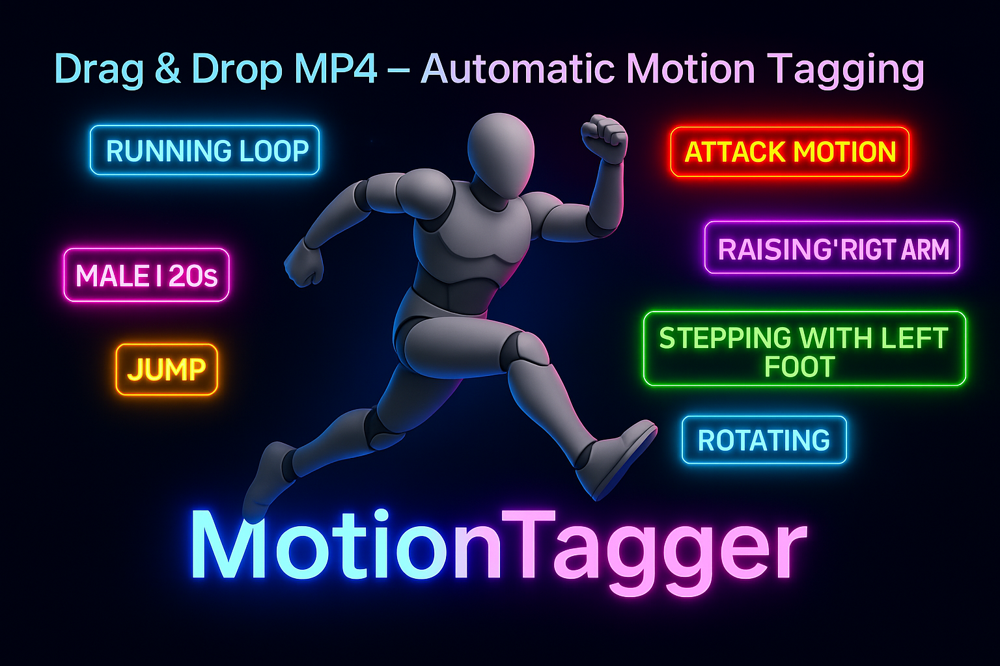

# MotionTagger




A tool for sending videos to AI for tagging

## Overview

This is an application that analyzes video files (mp4), automatically detects actions,
and outputs them in tabular format.
Examples of output content (customizable):
- Appropriate file name
- Male/female/age
- Detailed posture
- Description of movements
- Whether it can be LOOPed or not

Since the script simply specifies in natural language
"Write XX information!", you can get the information you want
by modifying it according to your needs.

The tag information that appears on the tool screen is minimal,
but when you export to CSV, it's filled with detailed tags.

### Customizing Prompts

Instructions to AI (prompts) are externalized as JSON files and
managed in the `config/prompts/` directory.
Users can:

- Select from existing prompt templates
- Create and save new prompts
- Edit or adjust prompts

Please refer to `config/prompts/sample01.json` for prompt examples.

## Main Features

- Loading and analyzing video files
- Automatic tagging function
- Creation and management of custom tags
- CSV export of analysis results
- Log management system
- JSON-based prompt management and selection

## System Requirements

- Python 3.8 or higher
- Windows 10/11

## Installation

1. Clone the repository:

2. Install dependencies:
```bash
pip install -r requirements.txt
```

3. Prepare configuration files:
- Describe application settings in `config/config.json`
- Configure Gemini API key

## How to Get Gemini API Key

Follow these steps to obtain a Gemini API key:

1. Access the official [Google Gemini](https://www.google.com/ai/gemini) website
2. Log in with your Google account or register a new one
3. Create a project and enable the Gemini API
4. Set the issued API key in the appropriate section of `config/config.json`

※ Please refer to Google's documentation for detailed instructions.

## Usage

1. How to start the application:

Launch with bat: run.bat
Launch with Python: src/main.py

2. Select a video file from the UI and start analysis

## Information for Developers

- Check logs: `logs/motion_tag_[date].log`
- Analysis results: `exports/csv/`
- To create an exe: pyinstaller MP4toExplainText.spec

## License

This project is released under the MIT license.
